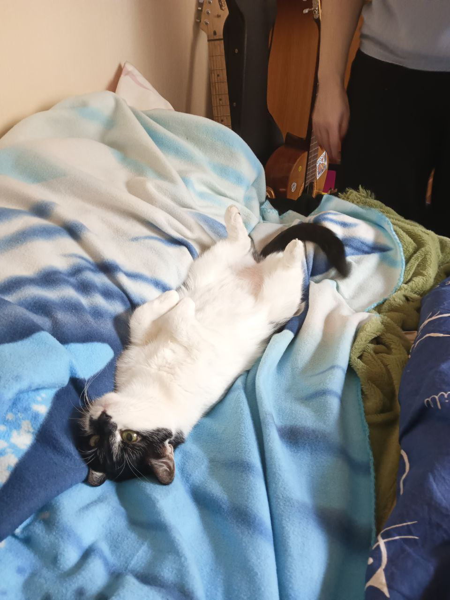

---
title: Как прошла моя неделя?
subtitle: Всех приветствую! В этом посте мне бы хотелось кратко рассказать о том, как прошла моя неделя. 

# Summary for listings and search engines
summary: Всех приветствую! В этом посте мне бы хотелось кратко рассказать о том, как прошла моя неделя. 

# Link this post with a project
projects: []

# Date published
date: '2024-03-16T00:00:00Z'

# Date updated
lastmod: '2024-03-16T00:00:00Z'

# Is this an unpublished draft?
draft: false

# Show this page in the Featured widget?
featured: false

# cat image
# Place an image named `cat.jpg` in this page's folder and customize its options here.
image: 
  caption:
  focal_point: ''
  placement: 5
  preview_only: false

authors:
  - admin
  - Nechaeva Kira

tags:
  - Academic
  - Nechaeva Kira

categories:
  - Demo
  - Nechaeva Kira
---

## Кратко пройдемся по дням недели 

Начнем с того, что в понедельник я проснулась с мыслью "Зачем мне всё это надо... Я никуда не пойду.". Однако к трём часам я поехала на репетицию для выступления на французском. Не самое приятное времяпрепровождение, зато после меня ждал вкусный кофе. В этот же день вечером у меня сломался мой под и я потратила "бешенные тыщи" на покупку нового. Это больно ударило по психике и по кошельку, потому было достаточно поучительно.

Во вторник ничего страшного не произошло, я съездила на занятие по физической культуре, чуть размялась и развеялась по пути от дома до корупса и обратно. Обидно, что на дорогу тратится больше времени, чем на само занятие.

В среду наконец-то были нормальные занятия по моей специальности. Однако вставать пришлось в 6:30, что неприятно. После занятий я приехала домой, пострадала какой-то фигней и в ночи села делать лабораторную работу. К двум часам ночи я полностью закончила и работу, и отчет, и презентацию и даже загрузила все файлы и ссылки (то бишь сдала работу).

В четверг опять подъем в 6:30. Это было очень неприятно, так как, как вы помните, я уснула только в 2 часа ночи. Но в целом четверг прошел неплохо, я даже не уснула на аналитической геометрии (но уснула на математической логике). В окно между парами сделала тест по истории и домашнее задание по английскому. Затем лекция по мат анализу и наконец-то домой!!!

В пятницу были 3 пары по английскому. Достаточно скучно, июо это монотонная работа. Хотя на первой паре мы репетировли выступление все полтора часа, что не модет не радовать. С третьей пары я ушла, так как мою лучшую подругу внезапно выписали из больницы спустя две недели с достаточно тяжелым заолеванием. Я не могла ее не встретить, поэтому в срочном порядке поехала к ней.

А сегодня, собственно, суббота. Пока я успела только сходить в поликлинику (боже как же это страшно) и написать этот пост.)

## Основные инсайты

- Я поняла, что нужно тратить меньше денег.
- Ко мне пришла мысль, что пора бросать курить.
- Я наконец-то сделала 6 лабораторну работу.
- Надо больше времени уделять мат анализу, да и остальным дисциплинам в принципе тоже.
- Пора бы уже начать разбираться с С++, ибо во втором семестре у меня до сих пор ничего не получается и я ничего не понимаю.(((((

## Сделала ли я что-то полезное, исходя из инсайтов?

Если честно, пока сама не поняла, изменила ли я как-то своб жизнь. Во вторник и в среду я ещё как-то заботилась о том, что нужно бросатьь курить. В четверг я уже так зае*, что стало всё равно.

Что касается трат, тут пока что относительно спокойно, вроде не особо много я сейчас покупаю ненужных вещей.

Изучение дисциплин... ну я думаю завтра приступить к выполнению дз по мат анализу и аналитической геометрии. Плююс пробежаться по лекциям, что наверное неплохо.

С++..... Слишком больная тема, однако после того, как я допишу этот пост, я думаю написать код, который мне сегодня же и сдавать.

## Выводы

Что ж, по моему субъективному мнению, неделя не была такой уж непродуктивной, Ибо:

- Я сделала неплохой доклад по истории.
- Я хорошо написала самостоятельную работу по мат анализу, ибо заблаговевременно неплохо разобралась в теме.
- Я сделала лабораторную работу !не в последний момент!
- Вроде как я выполняла все домашние задания.
- Больше чем обычно выходила на улицу и в принципе много ходила.

На этом я закончу свой рассказ. Спасибо, что прочитали мой пост!!!
